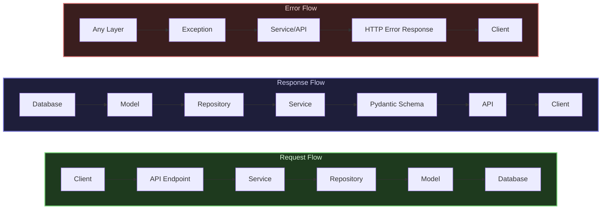
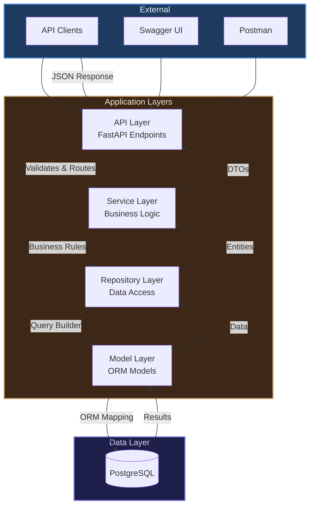
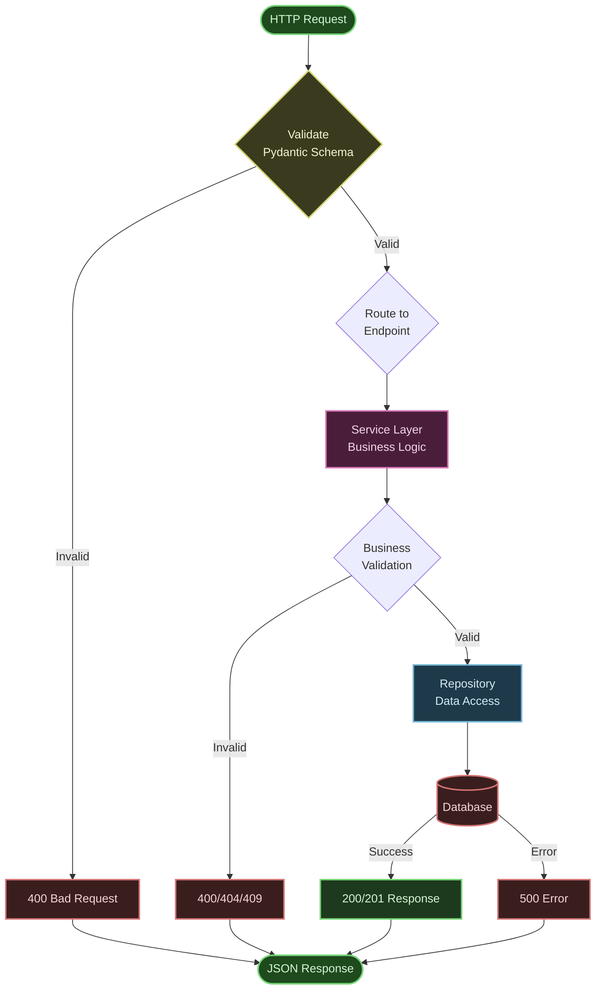

# Order Management System - Architecture Diagram

## System Architecture

```mermaid
flowchart TD
    Client[Client Layer<br/>Swagger UI, Postman,<br/>Frontend Applications]
    
    MainApp[FastAPI Application<br/>app/main.py<br/>- App Configuration<br/>- CORS Middleware<br/>- Router Registration]
    
    APILayer["API Layer<br/>app/api/v1/<br/>- orders.py - 3 endpoints<br/>- products.py - 4 endpoints<br/>- users.py - 3 endpoints<br/>- Request Validation<br/>- Error Handling<br/>- Swagger Documentation"]
    
    ServiceLayer[Service Layer<br/>app/services/<br/>- order_service.py<br/>- product_service.py<br/>- user_service.py<br/>- Business Logic<br/>- Validation Rules]
    
    RepoLayer[Repository Layer<br/>app/repositories/<br/>- base.py<br/>- order_repository.py<br/>- product_repository.py<br/>- user_repository.py<br/>- SQL Queries<br/>- Aggregations]
    
    ModelLayer["Model Layer<br/>app/models/<br/>- user.py<br/>- product.py<br/>- order.py<br/>- order_item.py<br/>- Relationships: User, Product<br/>- Constraints<br/>- Timestamps: created_at, updated_at"]
    
    Database[("PostgreSQL Database<br/>Schema: tony<br/>- users<br/>- products<br/>- orders with updated_at<br/>- order_items")]
    
    Client -->|HTTP/REST API| MainApp
    MainApp --> APILayer
    APILayer -->|Service Calls| ServiceLayer
    ServiceLayer -->|Repository Calls| RepoLayer
    RepoLayer -->|SQLAlchemy ORM| ModelLayer
    ModelLayer -->|Database Connection| Database
    
    style Client fill:#1e3a5f,stroke:#4a90e2,stroke-width:2px,color:#e8f4fd
    style MainApp fill:#3d2817,stroke:#d4a574,stroke-width:2px,color:#f5e6d3
    style APILayer fill:#4a1e3a,stroke:#e294d4,stroke-width:2px,color:#f5d4e8
    style ServiceLayer fill:#1e4a1e,stroke:#74d474,stroke-width:2px,color:#d4f5d4
    style RepoLayer fill:#3a1e4a,stroke:#b474d4,stroke-width:2px,color:#e8d4f5
    style ModelLayer fill:#4a1e1e,stroke:#d47474,stroke-width:2px,color:#f5d4d4
    style Database fill:#1e1e4a,stroke:#7474d4,stroke-width:2px,color:#d4d4f5
```

## Component Responsibilities

### API Layer
- **Purpose**: HTTP request/response handling
- **Responsibilities**:
  - Route requests to appropriate handlers
  - Validate input using Pydantic schemas
  - Handle HTTP status codes and error responses
  - Format responses

### Service Layer
- **Purpose**: Business logic and orchestration
- **Responsibilities**:
  - Implement business rules
  - Coordinate between repositories
  - Validate business constraints
  - Handle transactions

### Repository Layer
- **Purpose**: Data access abstraction
- **Responsibilities**:
  - Execute database queries
  - Implement filtering and aggregation
  - Manage database sessions
  - Optimize queries

### Model Layer
- **Purpose**: Database entity mapping
- **Responsibilities**:
  - Define table structures
  - Define relationships
  - Enforce constraints
  - Provide ORM mappings

## Data Flow

## Layer Interaction

## Key Design Patterns

1. **Layered Architecture**: Separation of concerns across layers
2. **Repository Pattern**: Abstraction of data access
3. **Dependency Injection**: FastAPI's dependency system
4. **Schema Validation**: Pydantic for request/response validation
5. **ORM Mapping**: SQLAlchemy for database operations

## Request Processing Pipeline

