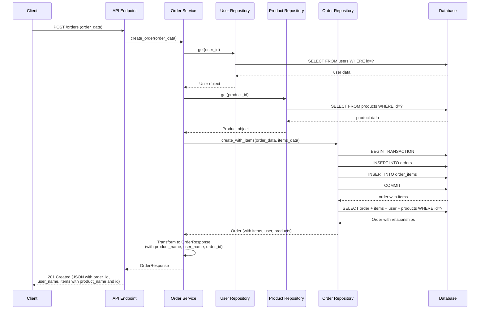
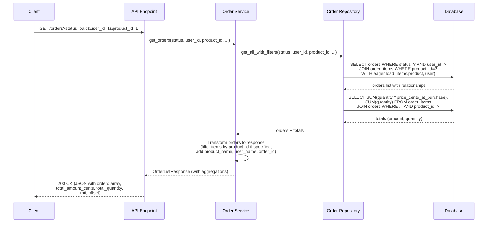
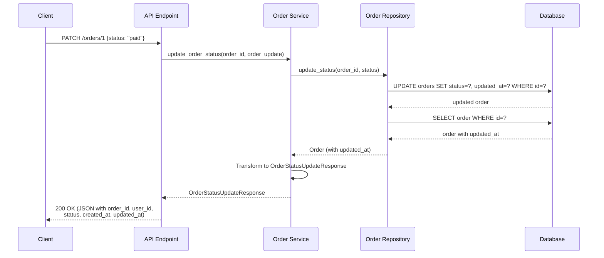
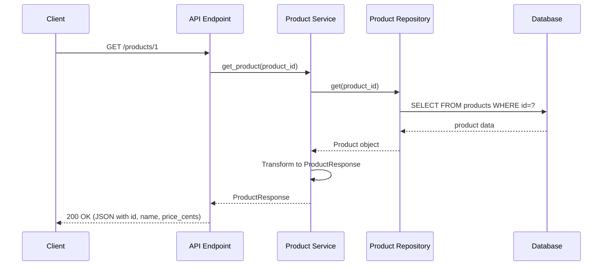
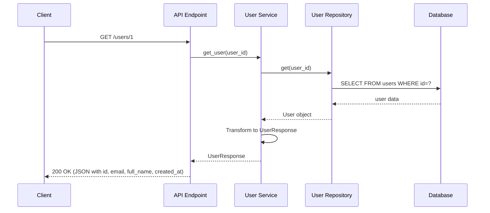
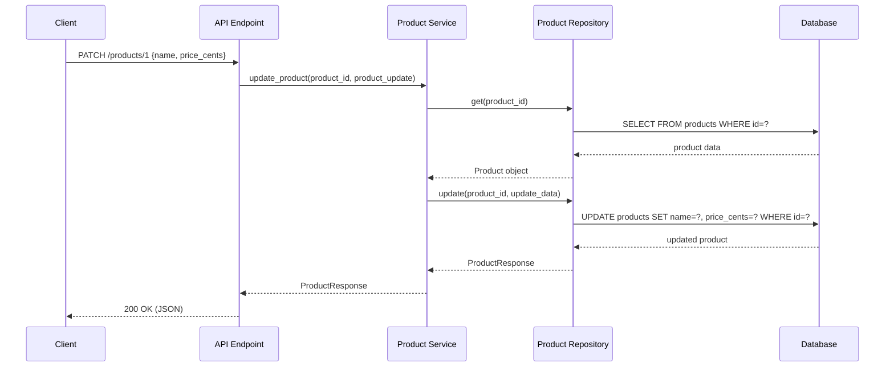
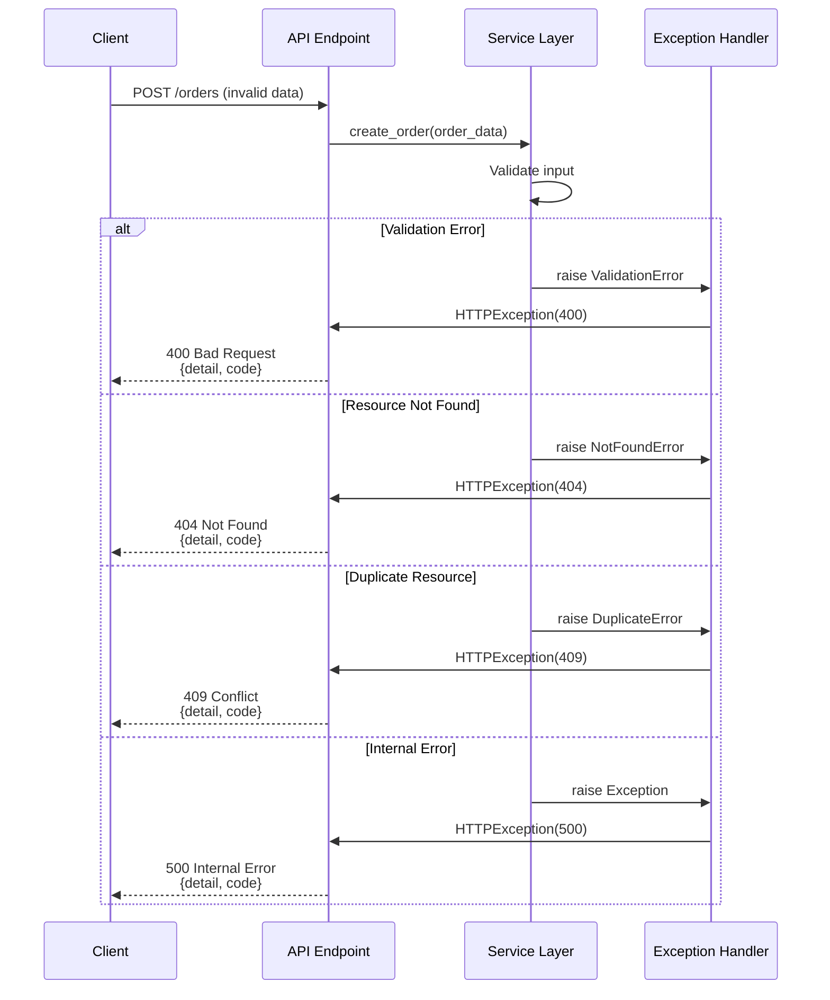
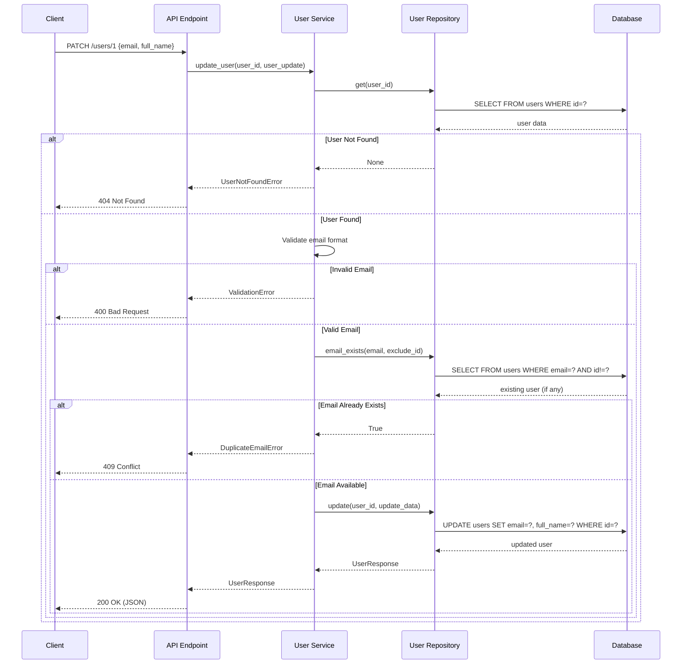
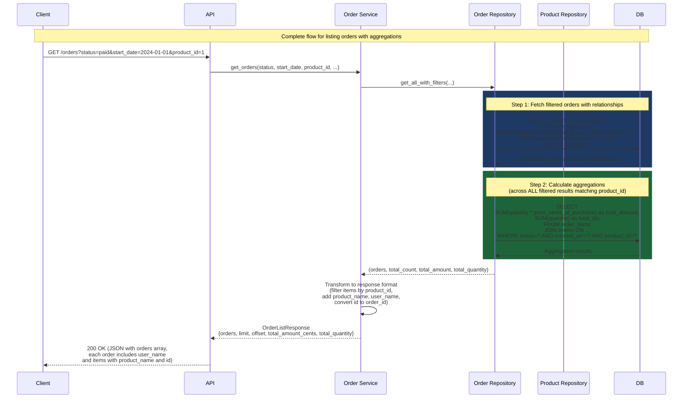

# Order Management System - Sequence Diagrams

## Sequence Diagram: Create Order

## Sequence Diagram: List Orders with Filters

## Sequence Diagram: Update Order Status

## Sequence Diagram: Get Product by ID

## Sequence Diagram: Get User by ID

## Sequence Diagram: Update Product

## Sequence Diagram: Error Handling

## Sequence Diagram: User Update with Email Validation

## Sequence Diagram: Complete Order Flow with Aggregation

